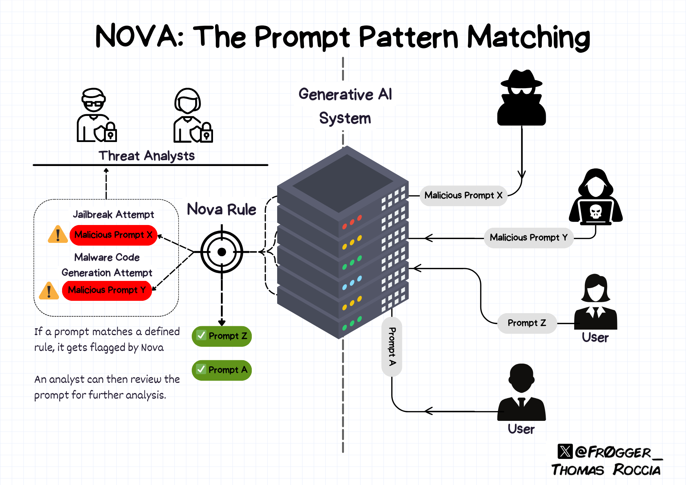

---
hide:
  - home
icon: material/home
title: Home
---


# NOVA: The Prompt Pattern Matching
Generative AI systems are rapidly being adopted and deployed across organizations. While they enhance productivity and efficiency, they also expand the attack surface.

How do you detect abusive usage of your system? How do you hunt for malicious prompts? Whether it is identifying jailbreaking attempts, preventing reputational damage, or spotting unexpected behaviors, tracking prompt TTPs can be very useful to track the usage of your AI systems.

That’s where NOVA comes in!

🚧 **Disclaimer:** NOVA is in its beta phase and undergoing early testing. Expect potential bugs, incomplete features, and ongoing improvements. If you identify a bug please report it here.

<p align="center">
    
</p>

NOVA is an open-source prompt pattern matching system that combines keyword detection, semantic similarity, and LLM-based evaluation to analyze and detect prompt content.

A NOVA rule can be used with the following capabilities:

- 🔍 Keyword Detection: Uses predefined keywords or regex to flag suspicious prompts.
- 💬 Semantic Similarity: Detects variations of patterns with configurable thresholds.
- ✨ LLM Matching: Uses LLM-based detection where you define a matching rule using natural language.

Built with a YARA-inspired syntax, a NOVA Rule is both readable and flexible. This is an initial attempt of creating a tool for prompt hunting.



## Anatomy of a NOVA rule

A **NOVA** rule follows this structure:  

```bash

rule RuleName
{
    meta:
        description = "Rule description"
        author = "Author name"
        
    keywords:
        $keyword1 = "exact text"
        $keyword2 = /regex pattern/i
        
    semantics:
        $semantic1 = "semantic pattern" (0.6)
        
    llm:
        $llm_check = "LLM evaluation prompt" (0.7)
        
    condition:
        keywords.$keyword1 or semantics.$semantic1 or llm.$llm_check
}
```

## Getting Started

<div class="grid cards" markdown>

-   :material-clock-fast:{ .lg .middle } __Set up in 2 minutes__

    ---

    Install [`Nova`]() with [`pip`](#)

    [:octicons-arrow-right-24: Installation](quickstarts/index.md)

-   :material-rocket-launch:{ .lg .middle } __Start experimenting__

    ---

    Write your first Nova Rule

    [:octicons-arrow-right-24: Learn Nova Rule](home/rules.md)

-   :material-console:{ .lg .middle } __Run Novarun__

    ---

    How to run Nova!

    [:octicons-arrow-right-24: Running Nova](quickstarts/running.md)

-   :material-scale-balance:{ .lg .middle } __Open Source, MIT__

    ---

    Nova is licensed under MIT and available on [GitHub]

    [:octicons-arrow-right-24: License]()

</div>

## Staying in touch 

Thomas Roccia